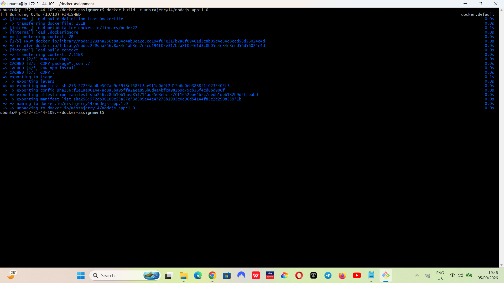
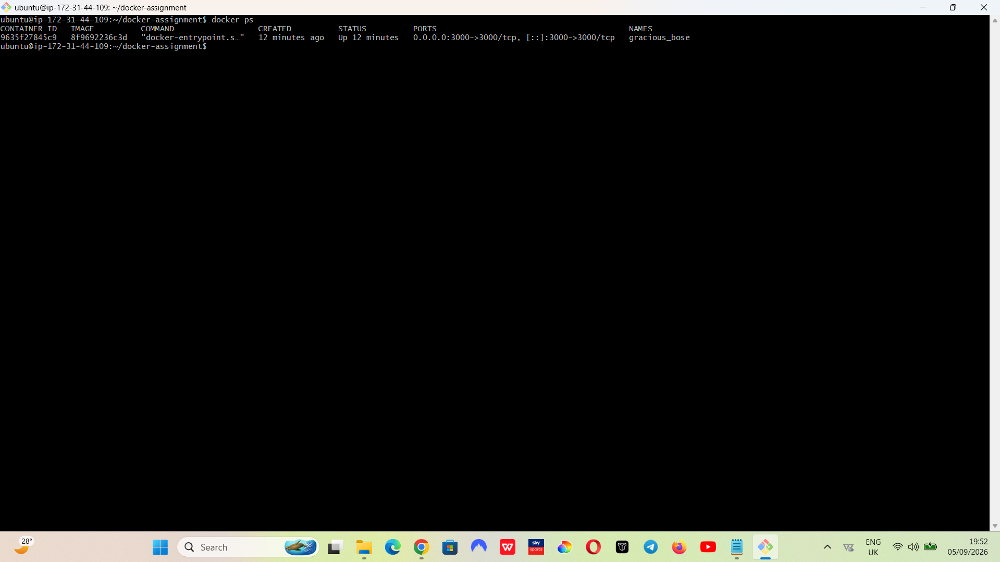
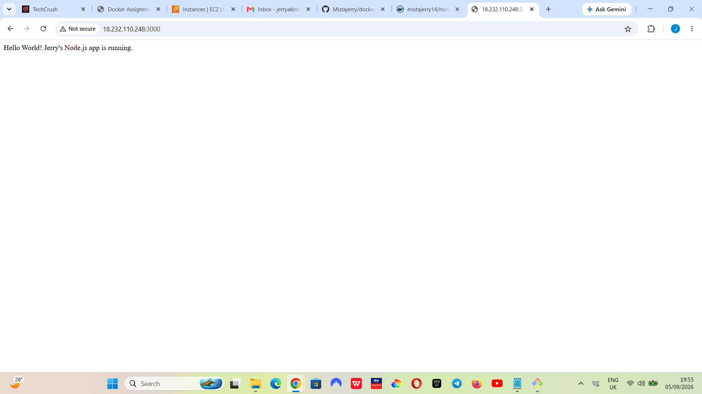

# Node.js Docker Assignment

## Project Overview

This project demonstrates how to build, containerize, and deploy a simple Node.js application using GitHub, Docker, Docker Hub, and an Ubuntu Linux server on AWS EC2.

## Technologies Used

- Node.js
- Express.js
- Git & GitHub
- Docker
- Docker Hub
- Ubuntu (AWS EC2)

## Project Structure

docker-assignment/
├── app.js
├── package.json
├── package-lock.json
├── Dockerfile
├── .gitignore
└── README.md

## Build the Docker Image

docker build -t mistajerry14/nodejs-app:1.0 .

## Run the Docker Container

docker run -d -p 3000:3000 mistajerry14/nodejs-app:1.0

## Docker Hub Repository

Docker Hub: https://hub.docker.com/r/mistajerry14/nodejs-app

# Screenshots

## 1. Docker Build Command

## 2. Docker Hub Image

## 3. Running Docker Container

## 4. Live Application

## Author

Jerry Akinbo

GitHub: https://github.com/Mistajerry
